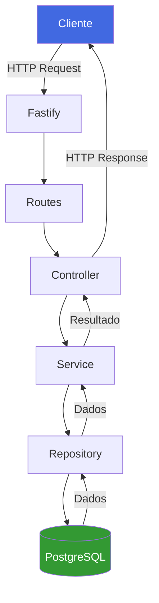
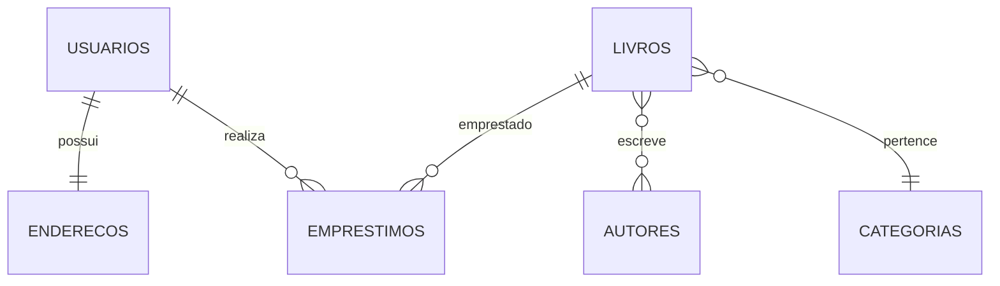
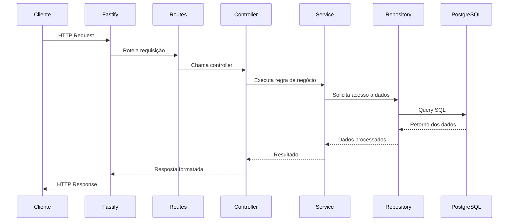

<div align="center">


<br>

[](https://git.io/typing-svg)

<p>


</p>

API REST desenvolvida para gerenciamento de bibliotecas.

Projeto desenvolvido para a disciplina de **Desenvolvimento Web**.

<br>

</div>

---

# 📑 Índice

- [📖 Sobre](#-sobre)
- [🎯 Objetivos](#-objetivos)
- [✨ Funcionalidades](#-funcionalidades)
- [🛠 Tecnologias](#-tecnologias)
- [🏛 Arquitetura](#-arquitetura)
- [📂 Estrutura do Projeto](#-estrutura-do-projeto)
- [🗄 Banco de Dados](#-banco-de-dados) 
- [📷 Prints do Swagger](#-prints-do-swagger) -em andamento
- [🚀 Como Executar](#-como-executar)
- [📄 Documentação](#-documentação)
- [🔗 Endpoints](#-endpoints) -em andamento
- [📈 Fluxo da Aplicação](#-fluxo-da-aplicação)
- [👥 Equipe](#-equipe)


---

# 📖 Sobre

A **API Biblioteca** é uma API REST desenvolvida para gerenciar uma biblioteca de forma organizada e eficiente.

O sistema permite o cadastro de usuários, autores, livros e empréstimos, além de disponibilizar consultas relacionais utilizando **JOIN**, documentação automática com **Swagger** e uma arquitetura baseada em boas práticas de desenvolvimento backend.

Durante o projeto foram aplicados conceitos como:

- Repository Pattern
- Service Layer
- Controller
- Injeção de Dependência
- Vertical Slice Architecture
- Tratamento centralizado de erros
- Documentação OpenAPI

---

# 🎯 Objetivos

- Gerenciar usuários
- Gerenciar autores
- Gerenciar livros
- Gerenciar empréstimos
- Aplicar PostgreSQL
- Utilizar Swagger
- Desenvolver uma API REST
- Aplicar arquitetura em camadas

---

# ✨ Funcionalidades

## 👤 Usuários

- Cadastro
- Consulta
- Atualização
- Exclusão

## ✍️ Autores

- Cadastro
- Consulta
- Atualização
- Exclusão

## 📚 Livros

- Cadastro
- Consulta
- Atualização
- Exclusão
- Associação de autores
- Consulta utilizando JOIN

## 📦 Empréstimos

- Cadastro
- Consulta
- Atualização
- Exclusão
- Consulta utilizando JOIN

## ✅ Funcionalidades implementadas

- CRUD completo
- Relacionamentos 1:1
- Relacionamentos 1:N
- Relacionamentos N:N
- Consultas com JOIN
- Swagger/OpenAPI
- Injeção de Dependência
- Repository Pattern
- Service Layer
- Tratamento centralizado de erros

---

# 🛠 Tecnologias

| Tecnologia | Utilização |
|------------|------------|
| Node.js | Ambiente JavaScript |
| Fastify | Framework Backend |
| PostgreSQL | Banco de Dados |
| Swagger | Documentação |
| Dotenv | Variáveis de Ambiente |
| Nodemon | Desenvolvimento |

---

# 🏛 Arquitetura

O projeto segue uma arquitetura em camadas, onde cada camada possui uma única responsabilidade, tornando o sistema desacoplado, organizado e de fácil manutenção.



---

# 📂 Estrutura do Projeto

```text
Biblioteca-DW26/
│
├── database.sql
├── package.json
├── package-lock.json
├── README.md
├── .env
├── .gitignore
│
└── src/
    │
    ├── server.js
    │
    ├── config/
    │   └── env.js
    │
    ├── database/
    │   └── connection.js
    │
    ├── docs/
    │   └── swagger.js
    │
    ├── errors/
    │   ├── AppError.js
    │   └── AppErrorHandler.js
    │
    ├── routes/
    │   └── index.js
    │
    └── features/
        │
        ├── usuarios/
        │   ├── index.js
        │   ├── UsuarioController.js
        │   ├── UsuarioService.js
        │   ├── UsuarioRepository.js
        │   └── usuario.routes.js
        │
        ├── autores/
        │   ├── index.js
        │   ├── AutorController.js
        │   ├── AutorService.js
        │   ├── AutorRepository.js
        │   └── autor.routes.js
        │
        ├── livros/
        │   ├── index.js
        │   ├── LivroController.js
        │   ├── LivroService.js
        │   ├── LivroRepository.js
        │   └── livro.routes.js
        │
        └── emprestimos/
            ├── index.js
            ├── EmprestimoController.js
            ├── EmprestimoService.js
            ├── EmprestimoRepository.js
            └── emprestimo.routes.js
```

---

# 🗄 Banco de Dados

O sistema utiliza **PostgreSQL**.

## Relacionamentos



## Tabelas

| Tabela | Descrição |
|---------|-----------|
| usuarios | Cadastro dos usuários |
| enderecos | Endereço dos usuários |
| autores | Cadastro dos autores |
| categorias | Categorias dos livros |
| livros | Cadastro dos livros |
| livros_autores | Relação entre livros e autores |
| emprestimos | Controle dos empréstimos |

---

# 🚀 Como Executar

## Clonar o projeto

```bash
git clone https://github.com/SEU-USUARIO/Biblioteca-DW26.git
```

## Entrar na pasta

```bash
cd Biblioteca-DW26
```

## Instalar dependências

```bash
npm install
```

## Configurar o `.env`

```env
PORT=3333

DB_HOST=localhost
DB_PORT=5432
DB_USER=postgres
DB_PASSWORD=sua_senha
DB_NAME=biblioteca_db
```

## Executar o banco

Execute o arquivo:

```text
database.sql
```

## Rodar a aplicação

```bash
npm run dev
```

Servidor:

```text
http://localhost:3333
```

Swagger:

```text
http://localhost:3333/docs
```

---

# 📄 Documentação

A API possui documentação automática utilizando **Swagger/OpenAPI**.

Após iniciar a aplicação:

```text
http://localhost:3333/docs
```

No Swagger é possível:

- Visualizar todos os endpoints;
- Testar requisições;
- Consultar parâmetros;
- Verificar respostas da API.

---

# 🔗 Endpoints

## Usuários

| Método | Endpoint |
|---------|----------|
| POST | `/usuarios` |
| GET | `/usuarios` |
| GET | `/usuarios/:id` |
| PUT | `/usuarios/:id` |
| DELETE | `/usuarios/:id` |

## Autores

| Método | Endpoint |
|---------|----------|
| POST | `/autores` |
| GET | `/autores` |
| GET | `/autores/:id` |
| PUT | `/autores/:id` |
| DELETE | `/autores/:id` |

## Livros

| Método | Endpoint |
|---------|----------|
| POST | `/livros` |
| GET | `/livros` |
| GET | `/livros/detalhes` |
| GET | `/livros/:id` |
| PUT | `/livros/:id` |
| DELETE | `/livros/:id` |
| POST | `/livros/:id/autores` |

## Empréstimos

| Método | Endpoint |
|---------|----------|
| POST | `/emprestimos` |
| GET | `/emprestimos` |
| GET | `/emprestimos/:id` |
| GET | `/emprestimos/:id/detalhes` |
| PUT | `/emprestimos/:id` |
| DELETE | `/emprestimos/:id` |

---

# 📈 Fluxo da Aplicação



---

# 👥 Equipe

| Integrante | Responsabilidades |
|------------|-------------------|
| **Yasmym Lemes** | Desenvolvimento dos módulos de Livros e Empréstimos, consultas com JOIN, Swagger, Injeção de Dependência e documentação |
| **Isabely** | Modelagem do banco de dados, módulos de Usuários e Autores, configuração inicial e tratamento de erros |

---

### ⭐ Obrigado por visitar este repositório!

Desenvolvido com ❤️ utilizando **Node.js**, **Fastify** e **PostgreSQL**.
<div align="center">


</div>
